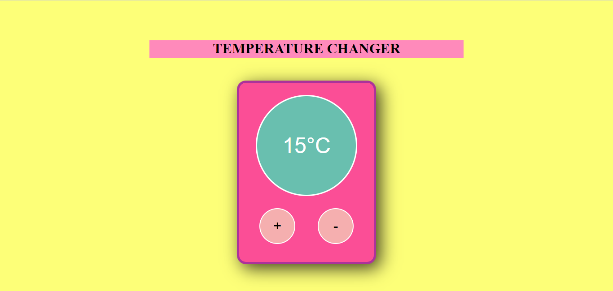
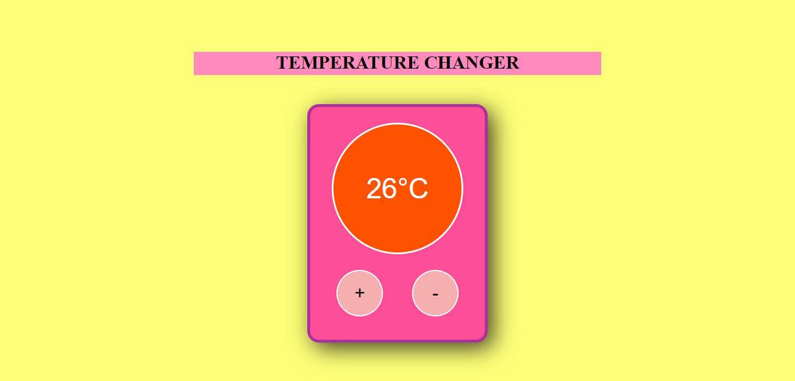
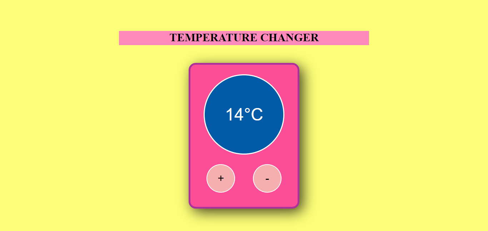

# Temperature-Changer 

## Description 
Developing on the concept of incrementing and decrementing counters, this temperature changer made using react enables the user to click on '+' and '-' buttons in order to increase or decrease the temperature counter by one with every click. Three main indications have been implemented: when the temperature is lesser than 15, the container turns blue in color to display that it is cold. Similarly, when the temperature exceeds 25, the container turns orange to show that it is hot. When the temperature lies within 15 and 25, the container changes to turquoise, indicating a mild/neutral temperature. Upper and lower limits have also been provided, thus preventing the user from clicking on and on, beyond 40 and/or -40. 

## Preview 
### Main page 
 

### When the temperature exceeds 25°C 
 

### When the temperature is lower than 15°C 
 
